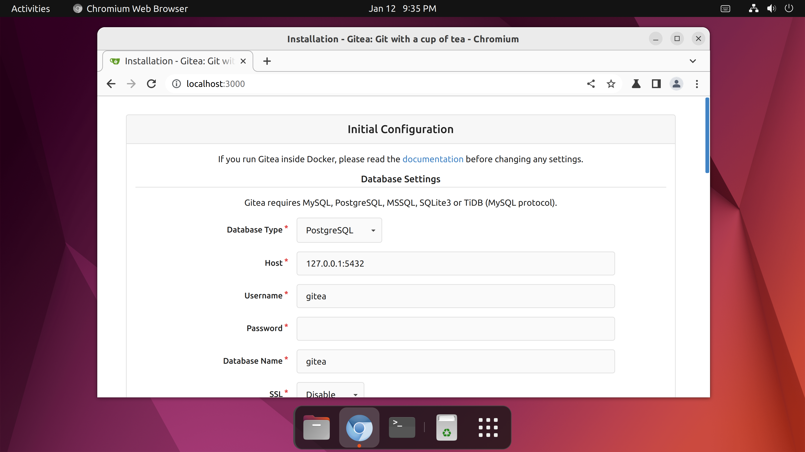
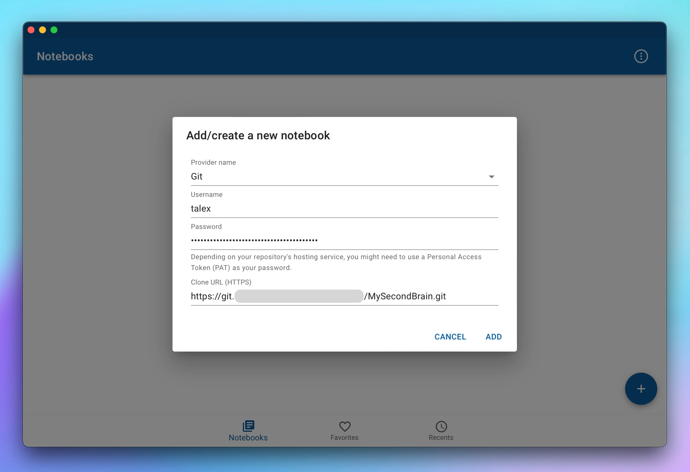

In this tutorial, we will learn how to self-host your notes in Git on a home server and access them with [NotesHub](/) from the internet completely for free _(assuming that you already have everything from the prerequisites section)_!

I would like to start by answering the question of why you may want this. Well, some people may not completely trust their data to be hosted by big companies and they also can change policies on how they handle your data, also this could be just a cool home project. If you are on board, let's dive in.

We'll use [Orange Pi](http://www.orangepi.org/) with Ubuntu installed as a home server, but any single-board computer ([Raspberry Pi](https://www.raspberrypi.com), etc) or Debian-based Linux server should work. Depending on your specific setup some commands may vary. It's important to follow the order of steps because some depend on each other.

## Prerequisites
- _Home server:_ a single-board computer (Orange Pi, Raspberry Pi, etc.) or Desktop computer
- _Linux OS:_ preferably Debian-based like Ubuntu, Raspberry Pi OS, etc.
- _Domain name:_ for demonstration in this tutorial, we will use `git.example.com` but you should replace it with something you own

## Setup Git server
In our setup, we will use [Gitea](https://about.gitea.com) as it's a very popular open-source solution for self-hosting a Git server and it will be very familiar to GitHub users.

### Install a database

You need a database to use Gitea. Gitea supports PostgreSQL (>= 12), MySQL (>= 8.0), MariaDB (>= 10.4), SQLite (builtin), and MSSQL (>= 2012 SP4). For this installation, we will use PostgreSQL.

Install PostgreSQL by using the following command:

```sh
sudo apt install postgresql
```

Open PostgreSQL terminal to create a user for Gitea:

```sh
sudo -u postgres psql -d template1
```

```sql
CREATE USER gitea CREATEDB;
```

To set the password for user _gitea_, type:

```sql
\password gitea
```
You will be asked to enter a password. Keep it for future reference.

Create a new database for Gitea:

```sql
CREATE DATABASE gitea OWNER gitea;
```

Exit the PostgreSQL terminal: `\q`

### Install Git

Check that Git is installed on the server. If it is not, install it first. Gitea requires Git version >= 2.0:

```sh
sudo apt install git
```

### Install Gitea

First, we start by creating a new user under which we will run the Gitea service. Use `–disabled-login` as we don't want to use it for login into our server. Use `–gecos` to allow us to set a name for the user, _git_:

```sh
sudo adduser --disabled-login --gecos 'Git Version Control' git
```

Switch to the newly created user:

```sh
sudo su git
```

Change to the home directory of user _git_ and create a new directory where we will store the Gitea binaries. We also switch to the new directory:

```sh
cd ~
mkdir gitea
cd gitea
```

Now we need to download the correct Gitea binaries. First, go to https://dl.gitea.io/gitea/ and pick the latest version, then find the file with the `-linux-arm64` ending, since our home server is Linux-based with the processor on ARM architecture. Copy the link of the actual file, and in the command below replace `GITEA_BINARY_URL` with that URL:

```sh
wget GITEA_BINARY_URL -O gitea
```

To be able to run it as a service, we first need to give execution rights to the file for the user _git_.
Finally, we exit from that user:

```sh
chmod +x gitea
exit
```

Now we need to make sure that Gitea will be automatically launched at startup. Let's create a service file with the following command:

```sh
sudo nano /etc/systemd/system/gitea.service
```

Copy the following content to the file:

```ini
[Unit]
Description=Gitea (Git with a cup of tea)
After=syslog.target
After=network.target

[Service]
# Modify these two values ​​and uncomment them if you have
# repos with lots of files and get to HTTP error 500 because of that
###
# LimitMEMLOCK=infinity
# LimitNOFILE=65535
RestartSec=2s
Type=simple
User=git
Group=git
WorkingDirectory=/home/git/gitea
ExecStart=/home/git/gitea/gitea web
Restart=always
Environment=USER=git
HOME=/home/git

[Install]
WantedBy=multi-user.target
```

Save the file with `Ctrl+X` followed by `Y` and then hit Enter.

If everything is correct we should now be able to enable and finally start our service:

```sh
sudo systemctl enable gitea.service
sudo systemctl start gitea.service
```

### Configure Gitea

Now that we have installed Gitea, we can proceed with the configuration part.
Navigate in the browser to the following URL `http://localhost:3000` from your home server, and you should be greeted with the Gitea _Initial Configuration_ screen.



If you strictly followed the instructions, it will require minimum input from you:

- **Database Settings**
  - _Database Type:_ choose PostgreSQL
  - _Password:_ enter the PostgreSQL user password used in previous steps
- **General Settings**
  - _Gitea Base URL:_ enter the intended public URL for your Git server (example: `https://git.example.com`), please note that you must own that domain name
  - _Enable Update Checker:_ check the option
- **Optional Settings**
  - _Disable Self-Registration:_ check the option
  - _Require Sign-In to View Pages:_ check the option
  - _Administrator Account Settings:_ enter username, email and password for new administrative account of Gitea server

Once you have set everything, you can go ahead and press the _Install Gitea_ button located at the bottom of the web page.

## Expose Git server to the Internet

If you get to this point than your Gitea instance should be accessible from `http://localhost:3000` (when navigating from home server). Our goal is to access it even outside the home. Let's continue our setup.

### Port forwarding

Port forwarding is a technique that enables remote servers and devices on the internet to access devices that are on a private network. If port forwarding is not enabled, only devices on the private internal network can communicate with each other or your network. Since we want to access our notes not only from home but from any place on earth, we need to enable it.

How to do this highly depends on your network router model, so we will not be able to cover all possible variants. You would have to search for how to enable port forwarding for your particular model.

As a general idea, we want all requests for ports _80_ and _443_ to be forwarded to our home server in our local network. Once it's done, you can move on to the next step.

### Dynamic DNS

Dynamic DNS or DDNS, is an automatic method of refreshing a name server. It can dynamically update DNS records without the need for human interaction. It is extremely useful for updating A and AAAA records when the host has changed its IP address. Since most houses don't have static IPs, this is an essential step to make sure your home server is accessible via a human-readable URL outside of the local network.

For this purpose, we will use [ddclient](https://github.com/ddclient/ddclient), go ahead and install it:

```sh
sudo apt install libio-socket-ssl-perl # depended Perl module
sudo apt install ddclient
```

Upon installation, you will be greeted with the _Configuration ddclient_ screen.
If your domain registrar is listed in the list, select it, otherwise choose _other_ and follow the prompts.
Since those prompts depend on your domain registrar we will omit them here.
As a general rule, you should research how to get DDNS credentials for your particular registrar.
Also, if your registrar was not on the initial list, you would have to manually update `/etc/ddclient.conf` file by following the instructions here: https://ddclient.net/protocols.html.

Finally, once everything is set we can go ahead and enable the automatic startup of _ddclient_ when booting and perform the first start:

```sh
sudo systemctl enable ddclient.service # enable automatic startup
sudo systemctl start ddclient.service # perform first start
```

### Reverse proxy

A [reverse proxy](https://en.wikipedia.org/wiki/Reverse_proxy) acts as a central contact point for clients and routes their requests to the appropriate backend service. It ensures that the backend service’s response is delivered to the correct client. This will allow us to access multiple services (applications) hosted on the same home server from the internet, which can be useful for future expansion.

In our case we will use [NGINX](https://www.nginx.com), let's install it:

```sh
sudo apt install nginx
```

Before testing Nginx, the firewall software needs to be adjusted to allow access to the service.
Let's install `ufw` (Uncomplicated Firewall) package to make the appropriate configuration:

```sh
sudo apt install ufw
sudo ufw enable
```

Let's adjust firewall rules to enable full traffic to Nginx:

```sh
sudo ufw allow 'Nginx Full'
```

Now we can configure Nginx to serve our Gitea service, by creating a new configuration file (replace `git.example.com` with your own):

```sh
sudo nano /etc/nginx/sites-available/git.example.com
```

```nginx
server {
  listen 80;
  # replace domain with your own
  server_name git.example.com;

  location / {
    client_max_body_size 512M;
    proxy_pass http://localhost:3000;
    proxy_set_header Connection $http_connection;
    proxy_set_header Upgrade $http_upgrade;
    proxy_set_header Host $host;
    proxy_set_header X-Real-IP $remote_addr;
    proxy_set_header X-Forwarded-For $proxy_add_x_forwarded_for;
    proxy_set_header X-Forwarded-Proto $scheme;
  }
}
```

Next, let’s enable the file by creating a link from it to the `sites-enabled` directory, which Nginx reads from during startup:

```sh
sudo ln -s /etc/nginx/sites-available/your_domain /etc/nginx/sites-enabled/
```

Let's reload Nginx configuration:

```sh
sudo service nginx reload
```

### SSL certificate

To make our service more secure let's add SSL certificate to serve our requests over HTTPS protocol.

We will use [Let’s Encrypt](https://letsencrypt.org) which is a Certificate Authority (CA) that provides an easy way to obtain and install free TLS/SSL certificates, thereby enabling encrypted HTTPS on web servers.

The first step to using Let’s Encrypt to obtain an SSL certificate is to install the _Certbot_ software on your server.

Install Certbot and it’s Nginx plugin with `apt`:

```sh
sudo apt install certbot python3-certbot-nginx
```

Now we can obtain an SSL certificate by running the following command:

```sh
sudo certbot --nginx -d git.example.com
```

Then follow a few prompts and your certificate should be issued. As a bonus auto-redirect from HTTP to HTTPS will be configured alongside certificate auto-renewal.

## Access notes with NotesHub

If you get this far, my congratulations, the most heavy lifting is done!
You should be able to navigate to `https://git.example.com` and create your first repository to store your notes.

")

Almost everything is ready to use it with NotesHub. Now we need to create app specific _access token_ to use it instead of the admin account password. Navigate in Gitea to _Settings -> Applications_, choose a token name (example: NotesHub) and click _Generate Token_.

Now open NotesHub and click the "+" button to add a new notebook, and choose Git provider.
- _Username_: could be anything since we use the access token instead of a password
- _Password_: specify here the newly generated access token from Gitea and keep it for future reference in case you want to add more notebooks
- _Clone URL_: on Gitea repository page you can find the value near the label _HTTPS_



Click _Add_ and your notebook will be cloned for offline use in the app.
Now as everything is done is the right time to drink tea!
