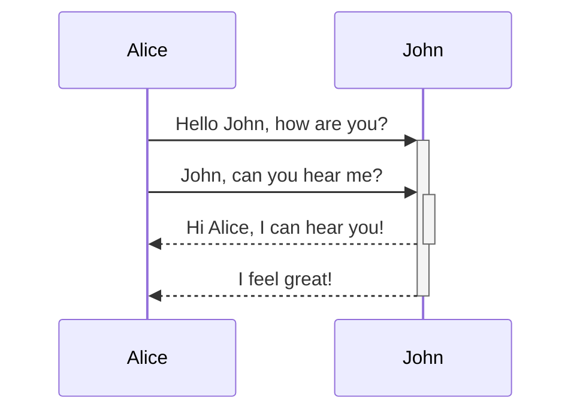

This is the most significant release as of Today. It has many new features, but most are related to enhanced Markdown editing experience. Let's dive into what's new.

## Markdown syntax highliting in the editor

This is arguably the most important change in this release and the most noticeable since it will touch the experience of every user. The Markdown editing experience is still a split-view of editor and preview but compare to the previous release you will see Markdown syntax highlighted in the editor. In addition to the changed font colors for different syntactic elements, you may see different font sizes (for headings) and more. All of that is designed to make navigation faster and improve the orientation in the document. This is especially important on mobile devices where due to small screen size instead of split-view you just see the editor or the preview but not both.

Let's see the real-life difference:


## Syntax highlighting in code-blocks

In addition to Markdown, this release expands syntax highlighting to code blocks for the most popular programming languages.


## Search/replace inside notes

Finally, you can search and replace text inside notes. In order to show the search panel on the Desktop, use `Ctrl+F` (`Cmd+F` on macOS) hotkey, or on mobile devices use _Search_ button from the editor toolbar.

As search options, you can toggle _match case_, _match whole word_, or _use regular expression_. All options are available as buttons inside the search field.


## Highlight (marker) tool

The new tool allows you to highlight text by marking it with a vivid, translucent yellow color, that will help to bring attention to sections of text.
To highlight text, use two equal signs `==` before and after the words. Also, you can achieve the same effect by selecting the text and clicking _Highlight_ button from the editor toolbar.


As an example the following Markdown:
```markdown
I need to highlight these ==very important words==.
```

Will be rendered to:

I need to highlight these <mark>very important words</mark>.

## Mermaid diagrams

[Mermaid](https://mermaid.js.org/intro/) is a flowchart and diagram visualization tool, it uses syntax inspired by Markdown in order to create and modify diagrams dynamically. If you are familiar with Markdown you should have no problem learning [Mermaid's Syntax](https://mermaid.js.org/intro/n00b-syntaxReference.html). It supports many [types of diagrams](https://mermaid.js.org/intro/) such as flowcharts, sequence diagrams, class diagrams, Gantt, mindmap, and many more.

To add a diagram, create a `mermaid` code block. For example, the following Markdown:

````markdown

````

Will be rendered to:

<svg class="mermaid" alt="mermaid sequence diagram example" aria-roledescription="sequence" role="graphics-document document" viewBox="-50 -10 501 363" xmlns="http://www.w3.org/2000/svg" width="100%" id="mermaid-30IGRRgBSNI2zDFmZp9N" class="mermaid" style="max-width: 501px;"><style>#mermaid-30IGRRgBSNI2zDFmZp9N{font-family:"trebuchet ms",verdana,arial,sans-serif;font-size:16px;fill:#000000;}#mermaid-30IGRRgBSNI2zDFmZp9N .error-icon{fill:#552222;}#mermaid-30IGRRgBSNI2zDFmZp9N .error-text{fill:#552222;stroke:#552222;}#mermaid-30IGRRgBSNI2zDFmZp9N .edge-thickness-normal{stroke-width:2px;}#mermaid-30IGRRgBSNI2zDFmZp9N .edge-thickness-thick{stroke-width:3.5px;}#mermaid-30IGRRgBSNI2zDFmZp9N .edge-pattern-solid{stroke-dasharray:0;}#mermaid-30IGRRgBSNI2zDFmZp9N .edge-pattern-dashed{stroke-dasharray:3;}#mermaid-30IGRRgBSNI2zDFmZp9N .edge-pattern-dotted{stroke-dasharray:2;}#mermaid-30IGRRgBSNI2zDFmZp9N .marker{fill:#666;stroke:#666;}#mermaid-30IGRRgBSNI2zDFmZp9N .marker.cross{stroke:#666;}#mermaid-30IGRRgBSNI2zDFmZp9N svg{font-family:"trebuchet ms",verdana,arial,sans-serif;font-size:16px;}#mermaid-30IGRRgBSNI2zDFmZp9N .actor{stroke:hsl(0, 0%, 83%);fill:#eee;}#mermaid-30IGRRgBSNI2zDFmZp9N text.actor&gt;tspan{fill:#333;stroke:none;}#mermaid-30IGRRgBSNI2zDFmZp9N .actor-line{stroke:#666;}#mermaid-30IGRRgBSNI2zDFmZp9N .messageLine0{stroke-width:1.5;stroke-dasharray:none;stroke:#333;}#mermaid-30IGRRgBSNI2zDFmZp9N .messageLine1{stroke-width:1.5;stroke-dasharray:2,2;stroke:#333;}#mermaid-30IGRRgBSNI2zDFmZp9N #arrowhead path{fill:#333;stroke:#333;}#mermaid-30IGRRgBSNI2zDFmZp9N .sequenceNumber{fill:white;}#mermaid-30IGRRgBSNI2zDFmZp9N #sequencenumber{fill:#333;}#mermaid-30IGRRgBSNI2zDFmZp9N #crosshead path{fill:#333;stroke:#333;}#mermaid-30IGRRgBSNI2zDFmZp9N .messageText{fill:#333;stroke:none;}#mermaid-30IGRRgBSNI2zDFmZp9N .labelBox{stroke:hsl(0, 0%, 83%);fill:#eee;}#mermaid-30IGRRgBSNI2zDFmZp9N .labelText,#mermaid-30IGRRgBSNI2zDFmZp9N .labelText&gt;tspan{fill:#333;stroke:none;}#mermaid-30IGRRgBSNI2zDFmZp9N .loopText,#mermaid-30IGRRgBSNI2zDFmZp9N .loopText&gt;tspan{fill:#333;stroke:none;}#mermaid-30IGRRgBSNI2zDFmZp9N .loopLine{stroke-width:2px;stroke-dasharray:2,2;stroke:hsl(0, 0%, 83%);fill:hsl(0, 0%, 83%);}#mermaid-30IGRRgBSNI2zDFmZp9N .note{stroke:#999;fill:#666;}#mermaid-30IGRRgBSNI2zDFmZp9N .noteText,#mermaid-30IGRRgBSNI2zDFmZp9N .noteText&gt;tspan{fill:#fff;stroke:none;}#mermaid-30IGRRgBSNI2zDFmZp9N .activation0{fill:#f4f4f4;stroke:#666;}#mermaid-30IGRRgBSNI2zDFmZp9N .activation1{fill:#f4f4f4;stroke:#666;}#mermaid-30IGRRgBSNI2zDFmZp9N .activation2{fill:#f4f4f4;stroke:#666;}#mermaid-30IGRRgBSNI2zDFmZp9N .actorPopupMenu{position:absolute;}#mermaid-30IGRRgBSNI2zDFmZp9N .actorPopupMenuPanel{position:absolute;fill:#eee;box-shadow:0px 8px 16px 0px rgba(0,0,0,0.2);filter:drop-shadow(3px 5px 2px rgb(0 0 0 / 0.4));}#mermaid-30IGRRgBSNI2zDFmZp9N .actor-man line{stroke:hsl(0, 0%, 83%);fill:#eee;}#mermaid-30IGRRgBSNI2zDFmZp9N .actor-man circle,#mermaid-30IGRRgBSNI2zDFmZp9N line{stroke:hsl(0, 0%, 83%);fill:#eee;stroke-width:2px;}#mermaid-30IGRRgBSNI2zDFmZp9N :root{--mermaid-font-family:"trebuchet ms",verdana,arial,sans-serif;}</style><g></g><defs><symbol height="24" width="24" id="computer"><path d="M2 2v13h20v-13h-20zm18 11h-16v-9h16v9zm-10.228 6l.466-1h3.524l.467 1h-4.457zm14.228 3h-24l2-6h2.104l-1.33 4h18.45l-1.297-4h2.073l2 6zm-5-10h-14v-7h14v7z" transform="scale(.5)"></path></symbol></defs><defs><symbol clip-rule="evenodd" fill-rule="evenodd" id="database"><path d="M12.258.001l.256.004.255.005.253.008.251.01.249.012.247.015.246.016.242.019.241.02.239.023.236.024.233.027.231.028.229.031.225.032.223.034.22.036.217.038.214.04.211.041.208.043.205.045.201.046.198.048.194.05.191.051.187.053.183.054.18.056.175.057.172.059.168.06.163.061.16.063.155.064.15.066.074.033.073.033.071.034.07.034.069.035.068.035.067.035.066.035.064.036.064.036.062.036.06.036.06.037.058.037.058.037.055.038.055.038.053.038.052.038.051.039.05.039.048.039.047.039.045.04.044.04.043.04.041.04.04.041.039.041.037.041.036.041.034.041.033.042.032.042.03.042.029.042.027.042.026.043.024.043.023.043.021.043.02.043.018.044.017.043.015.044.013.044.012.044.011.045.009.044.007.045.006.045.004.045.002.045.001.045v17l-.001.045-.002.045-.004.045-.006.045-.007.045-.009.044-.011.045-.012.044-.013.044-.015.044-.017.043-.018.044-.02.043-.021.043-.023.043-.024.043-.026.043-.027.042-.029.042-.03.042-.032.042-.033.042-.034.041-.036.041-.037.041-.039.041-.04.041-.041.04-.043.04-.044.04-.045.04-.047.039-.048.039-.05.039-.051.039-.052.038-.053.038-.055.038-.055.038-.058.037-.058.037-.06.037-.06.036-.062.036-.064.036-.064.036-.066.035-.067.035-.068.035-.069.035-.07.034-.071.034-.073.033-.074.033-.15.066-.155.064-.16.063-.163.061-.168.06-.172.059-.175.057-.18.056-.183.054-.187.053-.191.051-.194.05-.198.048-.201.046-.205.045-.208.043-.211.041-.214.04-.217.038-.22.036-.223.034-.225.032-.229.031-.231.028-.233.027-.236.024-.239.023-.241.02-.242.019-.246.016-.247.015-.249.012-.251.01-.253.008-.255.005-.256.004-.258.001-.258-.001-.256-.004-.255-.005-.253-.008-.251-.01-.249-.012-.247-.015-.245-.016-.243-.019-.241-.02-.238-.023-.236-.024-.234-.027-.231-.028-.228-.031-.226-.032-.223-.034-.22-.036-.217-.038-.214-.04-.211-.041-.208-.043-.204-.045-.201-.046-.198-.048-.195-.05-.19-.051-.187-.053-.184-.054-.179-.056-.176-.057-.172-.059-.167-.06-.164-.061-.159-.063-.155-.064-.151-.066-.074-.033-.072-.033-.072-.034-.07-.034-.069-.035-.068-.035-.067-.035-.066-.035-.064-.036-.063-.036-.062-.036-.061-.036-.06-.037-.058-.037-.057-.037-.056-.038-.055-.038-.053-.038-.052-.038-.051-.039-.049-.039-.049-.039-.046-.039-.046-.04-.044-.04-.043-.04-.041-.04-.04-.041-.039-.041-.037-.041-.036-.041-.034-.041-.033-.042-.032-.042-.03-.042-.029-.042-.027-.042-.026-.043-.024-.043-.023-.043-.021-.043-.02-.043-.018-.044-.017-.043-.015-.044-.013-.044-.012-.044-.011-.045-.009-.044-.007-.045-.006-.045-.004-.045-.002-.045-.001-.045v-17l.001-.045.002-.045.004-.045.006-.045.007-.045.009-.044.011-.045.012-.044.013-.044.015-.044.017-.043.018-.044.02-.043.021-.043.023-.043.024-.043.026-.043.027-.042.029-.042.03-.042.032-.042.033-.042.034-.041.036-.041.037-.041.039-.041.04-.041.041-.04.043-.04.044-.04.046-.04.046-.039.049-.039.049-.039.051-.039.052-.038.053-.038.055-.038.056-.038.057-.037.058-.037.06-.037.061-.036.062-.036.063-.036.064-.036.066-.035.067-.035.068-.035.069-.035.07-.034.072-.034.072-.033.074-.033.151-.066.155-.064.159-.063.164-.061.167-.06.172-.059.176-.057.179-.056.184-.054.187-.053.19-.051.195-.05.198-.048.201-.046.204-.045.208-.043.211-.041.214-.04.217-.038.22-.036.223-.034.226-.032.228-.031.231-.028.234-.027.236-.024.238-.023.241-.02.243-.019.245-.016.247-.015.249-.012.251-.01.253-.008.255-.005.256-.004.258-.001.258.001zm-9.258 20.499v.01l.001.021.003.021.004.022.005.021.006.022.007.022.009.023.01.022.011.023.012.023.013.023.015.023.016.024.017.023.018.024.019.024.021.024.022.025.023.024.024.025.052.049.056.05.061.051.066.051.07.051.075.051.079.052.084.052.088.052.092.052.097.052.102.051.105.052.11.052.114.051.119.051.123.051.127.05.131.05.135.05.139.048.144.049.147.047.152.047.155.047.16.045.163.045.167.043.171.043.176.041.178.041.183.039.187.039.19.037.194.035.197.035.202.033.204.031.209.03.212.029.216.027.219.025.222.024.226.021.23.02.233.018.236.016.24.015.243.012.246.01.249.008.253.005.256.004.259.001.26-.001.257-.004.254-.005.25-.008.247-.011.244-.012.241-.014.237-.016.233-.018.231-.021.226-.021.224-.024.22-.026.216-.027.212-.028.21-.031.205-.031.202-.034.198-.034.194-.036.191-.037.187-.039.183-.04.179-.04.175-.042.172-.043.168-.044.163-.045.16-.046.155-.046.152-.047.148-.048.143-.049.139-.049.136-.05.131-.05.126-.05.123-.051.118-.052.114-.051.11-.052.106-.052.101-.052.096-.052.092-.052.088-.053.083-.051.079-.052.074-.052.07-.051.065-.051.06-.051.056-.05.051-.05.023-.024.023-.025.021-.024.02-.024.019-.024.018-.024.017-.024.015-.023.014-.024.013-.023.012-.023.01-.023.01-.022.008-.022.006-.022.006-.022.004-.022.004-.021.001-.021.001-.021v-4.127l-.077.055-.08.053-.083.054-.085.053-.087.052-.09.052-.093.051-.095.05-.097.05-.1.049-.102.049-.105.048-.106.047-.109.047-.111.046-.114.045-.115.045-.118.044-.12.043-.122.042-.124.042-.126.041-.128.04-.13.04-.132.038-.134.038-.135.037-.138.037-.139.035-.142.035-.143.034-.144.033-.147.032-.148.031-.15.03-.151.03-.153.029-.154.027-.156.027-.158.026-.159.025-.161.024-.162.023-.163.022-.165.021-.166.02-.167.019-.169.018-.169.017-.171.016-.173.015-.173.014-.175.013-.175.012-.177.011-.178.01-.179.008-.179.008-.181.006-.182.005-.182.004-.184.003-.184.002h-.37l-.184-.002-.184-.003-.182-.004-.182-.005-.181-.006-.179-.008-.179-.008-.178-.01-.176-.011-.176-.012-.175-.013-.173-.014-.172-.015-.171-.016-.17-.017-.169-.018-.167-.019-.166-.02-.165-.021-.163-.022-.162-.023-.161-.024-.159-.025-.157-.026-.156-.027-.155-.027-.153-.029-.151-.03-.15-.03-.148-.031-.146-.032-.145-.033-.143-.034-.141-.035-.14-.035-.137-.037-.136-.037-.134-.038-.132-.038-.13-.04-.128-.04-.126-.041-.124-.042-.122-.042-.12-.044-.117-.043-.116-.045-.113-.045-.112-.046-.109-.047-.106-.047-.105-.048-.102-.049-.1-.049-.097-.05-.095-.05-.093-.052-.09-.051-.087-.052-.085-.053-.083-.054-.08-.054-.077-.054v4.127zm0-5.654v.011l.001.021.003.021.004.021.005.022.006.022.007.022.009.022.01.022.011.023.012.023.013.023.015.024.016.023.017.024.018.024.019.024.021.024.022.024.023.025.024.024.052.05.056.05.061.05.066.051.07.051.075.052.079.051.084.052.088.052.092.052.097.052.102.052.105.052.11.051.114.051.119.052.123.05.127.051.131.05.135.049.139.049.144.048.147.048.152.047.155.046.16.045.163.045.167.044.171.042.176.042.178.04.183.04.187.038.19.037.194.036.197.034.202.033.204.032.209.03.212.028.216.027.219.025.222.024.226.022.23.02.233.018.236.016.24.014.243.012.246.01.249.008.253.006.256.003.259.001.26-.001.257-.003.254-.006.25-.008.247-.01.244-.012.241-.015.237-.016.233-.018.231-.02.226-.022.224-.024.22-.025.216-.027.212-.029.21-.03.205-.032.202-.033.198-.035.194-.036.191-.037.187-.039.183-.039.179-.041.175-.042.172-.043.168-.044.163-.045.16-.045.155-.047.152-.047.148-.048.143-.048.139-.05.136-.049.131-.05.126-.051.123-.051.118-.051.114-.052.11-.052.106-.052.101-.052.096-.052.092-.052.088-.052.083-.052.079-.052.074-.051.07-.052.065-.051.06-.05.056-.051.051-.049.023-.025.023-.024.021-.025.02-.024.019-.024.018-.024.017-.024.015-.023.014-.023.013-.024.012-.022.01-.023.01-.023.008-.022.006-.022.006-.022.004-.021.004-.022.001-.021.001-.021v-4.139l-.077.054-.08.054-.083.054-.085.052-.087.053-.09.051-.093.051-.095.051-.097.05-.1.049-.102.049-.105.048-.106.047-.109.047-.111.046-.114.045-.115.044-.118.044-.12.044-.122.042-.124.042-.126.041-.128.04-.13.039-.132.039-.134.038-.135.037-.138.036-.139.036-.142.035-.143.033-.144.033-.147.033-.148.031-.15.03-.151.03-.153.028-.154.028-.156.027-.158.026-.159.025-.161.024-.162.023-.163.022-.165.021-.166.02-.167.019-.169.018-.169.017-.171.016-.173.015-.173.014-.175.013-.175.012-.177.011-.178.009-.179.009-.179.007-.181.007-.182.005-.182.004-.184.003-.184.002h-.37l-.184-.002-.184-.003-.182-.004-.182-.005-.181-.007-.179-.007-.179-.009-.178-.009-.176-.011-.176-.012-.175-.013-.173-.014-.172-.015-.171-.016-.17-.017-.169-.018-.167-.019-.166-.02-.165-.021-.163-.022-.162-.023-.161-.024-.159-.025-.157-.026-.156-.027-.155-.028-.153-.028-.151-.03-.15-.03-.148-.031-.146-.033-.145-.033-.143-.033-.141-.035-.14-.036-.137-.036-.136-.037-.134-.038-.132-.039-.13-.039-.128-.04-.126-.041-.124-.042-.122-.043-.12-.043-.117-.044-.116-.044-.113-.046-.112-.046-.109-.046-.106-.047-.105-.048-.102-.049-.1-.049-.097-.05-.095-.051-.093-.051-.09-.051-.087-.053-.085-.052-.083-.054-.08-.054-.077-.054v4.139zm0-5.666v.011l.001.02.003.022.004.021.005.022.006.021.007.022.009.023.01.022.011.023.012.023.013.023.015.023.016.024.017.024.018.023.019.024.021.025.022.024.023.024.024.025.052.05.056.05.061.05.066.051.07.051.075.052.079.051.084.052.088.052.092.052.097.052.102.052.105.051.11.052.114.051.119.051.123.051.127.05.131.05.135.05.139.049.144.048.147.048.152.047.155.046.16.045.163.045.167.043.171.043.176.042.178.04.183.04.187.038.19.037.194.036.197.034.202.033.204.032.209.03.212.028.216.027.219.025.222.024.226.021.23.02.233.018.236.017.24.014.243.012.246.01.249.008.253.006.256.003.259.001.26-.001.257-.003.254-.006.25-.008.247-.01.244-.013.241-.014.237-.016.233-.018.231-.02.226-.022.224-.024.22-.025.216-.027.212-.029.21-.03.205-.032.202-.033.198-.035.194-.036.191-.037.187-.039.183-.039.179-.041.175-.042.172-.043.168-.044.163-.045.16-.045.155-.047.152-.047.148-.048.143-.049.139-.049.136-.049.131-.051.126-.05.123-.051.118-.052.114-.051.11-.052.106-.052.101-.052.096-.052.092-.052.088-.052.083-.052.079-.052.074-.052.07-.051.065-.051.06-.051.056-.05.051-.049.023-.025.023-.025.021-.024.02-.024.019-.024.018-.024.017-.024.015-.023.014-.024.013-.023.012-.023.01-.022.01-.023.008-.022.006-.022.006-.022.004-.022.004-.021.001-.021.001-.021v-4.153l-.077.054-.08.054-.083.053-.085.053-.087.053-.09.051-.093.051-.095.051-.097.05-.1.049-.102.048-.105.048-.106.048-.109.046-.111.046-.114.046-.115.044-.118.044-.12.043-.122.043-.124.042-.126.041-.128.04-.13.039-.132.039-.134.038-.135.037-.138.036-.139.036-.142.034-.143.034-.144.033-.147.032-.148.032-.15.03-.151.03-.153.028-.154.028-.156.027-.158.026-.159.024-.161.024-.162.023-.163.023-.165.021-.166.02-.167.019-.169.018-.169.017-.171.016-.173.015-.173.014-.175.013-.175.012-.177.01-.178.01-.179.009-.179.007-.181.006-.182.006-.182.004-.184.003-.184.001-.185.001-.185-.001-.184-.001-.184-.003-.182-.004-.182-.006-.181-.006-.179-.007-.179-.009-.178-.01-.176-.01-.176-.012-.175-.013-.173-.014-.172-.015-.171-.016-.17-.017-.169-.018-.167-.019-.166-.02-.165-.021-.163-.023-.162-.023-.161-.024-.159-.024-.157-.026-.156-.027-.155-.028-.153-.028-.151-.03-.15-.03-.148-.032-.146-.032-.145-.033-.143-.034-.141-.034-.14-.036-.137-.036-.136-.037-.134-.038-.132-.039-.13-.039-.128-.041-.126-.041-.124-.041-.122-.043-.12-.043-.117-.044-.116-.044-.113-.046-.112-.046-.109-.046-.106-.048-.105-.048-.102-.048-.1-.05-.097-.049-.095-.051-.093-.051-.09-.052-.087-.052-.085-.053-.083-.053-.08-.054-.077-.054v4.153zm8.74-8.179l-.257.004-.254.005-.25.008-.247.011-.244.012-.241.014-.237.016-.233.018-.231.021-.226.022-.224.023-.22.026-.216.027-.212.028-.21.031-.205.032-.202.033-.198.034-.194.036-.191.038-.187.038-.183.04-.179.041-.175.042-.172.043-.168.043-.163.045-.16.046-.155.046-.152.048-.148.048-.143.048-.139.049-.136.05-.131.05-.126.051-.123.051-.118.051-.114.052-.11.052-.106.052-.101.052-.096.052-.092.052-.088.052-.083.052-.079.052-.074.051-.07.052-.065.051-.06.05-.056.05-.051.05-.023.025-.023.024-.021.024-.02.025-.019.024-.018.024-.017.023-.015.024-.014.023-.013.023-.012.023-.01.023-.01.022-.008.022-.006.023-.006.021-.004.022-.004.021-.001.021-.001.021.001.021.001.021.004.021.004.022.006.021.006.023.008.022.01.022.01.023.012.023.013.023.014.023.015.024.017.023.018.024.019.024.02.025.021.024.023.024.023.025.051.05.056.05.06.05.065.051.07.052.074.051.079.052.083.052.088.052.092.052.096.052.101.052.106.052.11.052.114.052.118.051.123.051.126.051.131.05.136.05.139.049.143.048.148.048.152.048.155.046.16.046.163.045.168.043.172.043.175.042.179.041.183.04.187.038.191.038.194.036.198.034.202.033.205.032.21.031.212.028.216.027.22.026.224.023.226.022.231.021.233.018.237.016.241.014.244.012.247.011.25.008.254.005.257.004.26.001.26-.001.257-.004.254-.005.25-.008.247-.011.244-.012.241-.014.237-.016.233-.018.231-.021.226-.022.224-.023.22-.026.216-.027.212-.028.21-.031.205-.032.202-.033.198-.034.194-.036.191-.038.187-.038.183-.04.179-.041.175-.042.172-.043.168-.043.163-.045.16-.046.155-.046.152-.048.148-.048.143-.048.139-.049.136-.05.131-.05.126-.051.123-.051.118-.051.114-.052.11-.052.106-.052.101-.052.096-.052.092-.052.088-.052.083-.052.079-.052.074-.051.07-.052.065-.051.06-.05.056-.05.051-.05.023-.025.023-.024.021-.024.02-.025.019-.024.018-.024.017-.023.015-.024.014-.023.013-.023.012-.023.01-.023.01-.022.008-.022.006-.023.006-.021.004-.022.004-.021.001-.021.001-.021-.001-.021-.001-.021-.004-.021-.004-.022-.006-.021-.006-.023-.008-.022-.01-.022-.01-.023-.012-.023-.013-.023-.014-.023-.015-.024-.017-.023-.018-.024-.019-.024-.02-.025-.021-.024-.023-.024-.023-.025-.051-.05-.056-.05-.06-.05-.065-.051-.07-.052-.074-.051-.079-.052-.083-.052-.088-.052-.092-.052-.096-.052-.101-.052-.106-.052-.11-.052-.114-.052-.118-.051-.123-.051-.126-.051-.131-.05-.136-.05-.139-.049-.143-.048-.148-.048-.152-.048-.155-.046-.16-.046-.163-.045-.168-.043-.172-.043-.175-.042-.179-.041-.183-.04-.187-.038-.191-.038-.194-.036-.198-.034-.202-.033-.205-.032-.21-.031-.212-.028-.216-.027-.22-.026-.224-.023-.226-.022-.231-.021-.233-.018-.237-.016-.241-.014-.244-.012-.247-.011-.25-.008-.254-.005-.257-.004-.26-.001-.26.001z" transform="scale(.5)"></path></symbol></defs><defs><symbol height="24" width="24" id="clock"><path d="M12 2c5.514 0 10 4.486 10 10s-4.486 10-10 10-10-4.486-10-10 4.486-10 10-10zm0-2c-6.627 0-12 5.373-12 12s5.373 12 12 12 12-5.373 12-12-5.373-12-12-12zm5.848 12.459c.202.038.202.333.001.372-1.907.361-6.045 1.111-6.547 1.111-.719 0-1.301-.582-1.301-1.301 0-.512.77-5.447 1.125-7.445.034-.192.312-.181.343.014l.985 6.238 5.394 1.011z" transform="scale(.5)"></path></symbol></defs><g><line stroke="#999" stroke-width="0.5px" class="200" y2="297" x2="75" y1="5" x1="75" id="actor4"></line><g id="root-4"><rect class="actor" ry="3" rx="3" height="65" width="150" stroke="#666" fill="#eaeaea" y="0" x="0"></rect><text class="actor" alignment-baseline="central" dominant-baseline="central" y="32.5" x="75" style="text-anchor: middle; font-size: 16px; font-weight: 400;"><tspan dy="0" x="75">Alice</tspan></text></g></g><g><line stroke="#999" stroke-width="0.5px" class="200" y2="297" x2="326" y1="5" x1="326" id="actor5"></line><g id="root-5"><rect class="actor" ry="3" rx="3" height="65" width="150" stroke="#666" fill="#eaeaea" y="0" x="251"></rect><text class="actor" alignment-baseline="central" dominant-baseline="central" y="32.5" x="326" style="text-anchor: middle; font-size: 16px; font-weight: 400;"><tspan dy="0" x="326">John</tspan></text></g></g><defs><marker orient="auto" markerHeight="12" markerWidth="12" markerUnits="userSpaceOnUse" refY="5" refX="9" id="arrowhead"><path d="M 0 0 L 10 5 L 0 10 z"></path></marker></defs><defs><marker refY="5" refX="4" orient="auto" markerHeight="8" markerWidth="15" id="crosshead"><path d="M 1,2 L 6,7 M 6,2 L 1,7" stroke-width="1pt" stroke="#000000" fill="none" style="stroke-dasharray: 0, 0;"></path></marker></defs><defs><marker orient="auto" markerHeight="28" markerWidth="20" refY="7" refX="18" id="filled-head"><path d="M 18,7 L9,13 L14,7 L9,1 Z"></path></marker></defs><defs><marker orient="auto" markerHeight="40" markerWidth="60" refY="15" refX="15" id="sequencenumber"><circle r="6" cy="15" cx="15"></circle></marker></defs><g><rect class="activation0" ry="0" rx="0" height="144" width="10" stroke="#666" fill="#EDF2AE" y="113" x="321"></rect></g><g><rect class="activation1" ry="0" rx="0" height="46" width="10" stroke="#666" fill="#EDF2AE" y="163" x="326"></rect></g><text dy="1em" class="messageText" alignment-baseline="middle" dominant-baseline="middle" text-anchor="middle" y="80" x="201" style="font-size: 16px; font-weight: 400;">Hello John, how are you?</text><line marker-end="url(#arrowhead)" stroke="none" stroke-width="2" class="messageLine0" y2="113" x2="326" y1="113" x1="75" style="fill: none;"></line><text dy="1em" class="messageText" alignment-baseline="middle" dominant-baseline="middle" text-anchor="middle" y="128" x="198" style="font-size: 16px; font-weight: 400;">John, can you hear me?</text><line marker-end="url(#arrowhead)" stroke="none" stroke-width="2" class="messageLine0" y2="161" x2="321" y1="161" x1="75" style="fill: none;"></line><text dy="1em" class="messageText" alignment-baseline="middle" dominant-baseline="middle" text-anchor="middle" y="176" x="198" style="font-size: 16px; font-weight: 400;">Hi Alice, I can hear you!</text><line marker-end="url(#arrowhead)" stroke="none" stroke-width="2" class="messageLine1" y2="209" x2="75" y1="209" x1="321" style="stroke-dasharray: 3, 3; fill: none;"></line><text dy="1em" class="messageText" alignment-baseline="middle" dominant-baseline="middle" text-anchor="middle" y="224" x="198" style="font-size: 16px; font-weight: 400;">I feel great!</text><line marker-end="url(#arrowhead)" stroke="none" stroke-width="2" class="messageLine1" y2="257" x2="75" y1="257" x1="321" style="stroke-dasharray: 3, 3; fill: none;"></line><g><rect class="actor" ry="3" rx="3" height="65" width="150" stroke="#666" fill="#eaeaea" y="277" x="0"></rect><text class="actor" alignment-baseline="central" dominant-baseline="central" y="309.5" x="75" style="text-anchor: middle; font-size: 16px; font-weight: 400;"><tspan dy="0" x="75">Alice</tspan></text></g><g><rect class="actor" ry="3" rx="3" height="65" width="150" stroke="#666" fill="#eaeaea" y="277" x="251"></rect><text class="actor" alignment-baseline="central" dominant-baseline="central" y="309.5" x="326" style="text-anchor: middle; font-size: 16px; font-weight: 400;"><tspan dy="0" x="326">John</tspan></text></g></svg>

## Math expressions

Mathematical expressions in this release are powered by [MathJax](https://www.mathjax.org) library that utilizes [LaTeX](https://en.wikibooks.org/wiki/LaTeX) notation. For the available syntax refer to [MathJax basic tutorial and quick reference](https://math.meta.stackexchange.com/questions/5020/mathjax-basic-tutorial-and-quick-reference).

To add inline math expressions wrap them in `$` symbols. To create math blocks, use two dollar signs `$$` on the lines before and after the math block.

Example:
```markdown
The length of the hypotenuse: $c=\sqrt{a^2+b^2}$

Chemical formula of water: $\ce{H2O}$

The determinant of 2-by-2 matrices is given by
$$
\det
\begin{bmatrix}
a&b\\
c&d\\
\end{bmatrix}
= ad-bc
$$
```

Will be rendered to:

The length of the hypotenuse: <svg xmlns="http://www.w3.org/2000/svg" width="13.213ex" height="2.851ex" role="img" focusable="false" viewBox="0 -1114.2 5840.1 1260" xmlns:xlink="http://www.w3.org/1999/xlink" style="vertical-align: -0.33ex;"><defs><path id="MJX-34-TEX-I-1D450" d="M34 159Q34 268 120 355T306 442Q362 442 394 418T427 355Q427 326 408 306T360 285Q341 285 330 295T319 325T330 359T352 380T366 386H367Q367 388 361 392T340 400T306 404Q276 404 249 390Q228 381 206 359Q162 315 142 235T121 119Q121 73 147 50Q169 26 205 26H209Q321 26 394 111Q403 121 406 121Q410 121 419 112T429 98T420 83T391 55T346 25T282 0T202 -11Q127 -11 81 37T34 159Z"></path><path id="MJX-34-TEX-N-3D" d="M56 347Q56 360 70 367H707Q722 359 722 347Q722 336 708 328L390 327H72Q56 332 56 347ZM56 153Q56 168 72 173H708Q722 163 722 153Q722 140 707 133H70Q56 140 56 153Z"></path><path id="MJX-34-TEX-SO-221A" d="M263 249Q264 249 315 130T417 -108T470 -228L725 302Q981 837 982 839Q989 850 1001 850Q1008 850 1013 844T1020 832V826L741 243Q645 43 540 -176Q479 -303 469 -324T453 -348Q449 -350 436 -350L424 -349L315 -96Q206 156 205 156L171 130Q138 104 137 104L111 130L263 249Z"></path><path id="MJX-34-TEX-I-1D44E" d="M33 157Q33 258 109 349T280 441Q331 441 370 392Q386 422 416 422Q429 422 439 414T449 394Q449 381 412 234T374 68Q374 43 381 35T402 26Q411 27 422 35Q443 55 463 131Q469 151 473 152Q475 153 483 153H487Q506 153 506 144Q506 138 501 117T481 63T449 13Q436 0 417 -8Q409 -10 393 -10Q359 -10 336 5T306 36L300 51Q299 52 296 50Q294 48 292 46Q233 -10 172 -10Q117 -10 75 30T33 157ZM351 328Q351 334 346 350T323 385T277 405Q242 405 210 374T160 293Q131 214 119 129Q119 126 119 118T118 106Q118 61 136 44T179 26Q217 26 254 59T298 110Q300 114 325 217T351 328Z"></path><path id="MJX-34-TEX-N-32" d="M109 429Q82 429 66 447T50 491Q50 562 103 614T235 666Q326 666 387 610T449 465Q449 422 429 383T381 315T301 241Q265 210 201 149L142 93L218 92Q375 92 385 97Q392 99 409 186V189H449V186Q448 183 436 95T421 3V0H50V19V31Q50 38 56 46T86 81Q115 113 136 137Q145 147 170 174T204 211T233 244T261 278T284 308T305 340T320 369T333 401T340 431T343 464Q343 527 309 573T212 619Q179 619 154 602T119 569T109 550Q109 549 114 549Q132 549 151 535T170 489Q170 464 154 447T109 429Z"></path><path id="MJX-34-TEX-N-2B" d="M56 237T56 250T70 270H369V420L370 570Q380 583 389 583Q402 583 409 568V270H707Q722 262 722 250T707 230H409V-68Q401 -82 391 -82H389H387Q375 -82 369 -68V230H70Q56 237 56 250Z"></path><path id="MJX-34-TEX-I-1D44F" d="M73 647Q73 657 77 670T89 683Q90 683 161 688T234 694Q246 694 246 685T212 542Q204 508 195 472T180 418L176 399Q176 396 182 402Q231 442 283 442Q345 442 383 396T422 280Q422 169 343 79T173 -11Q123 -11 82 27T40 150V159Q40 180 48 217T97 414Q147 611 147 623T109 637Q104 637 101 637H96Q86 637 83 637T76 640T73 647ZM336 325V331Q336 405 275 405Q258 405 240 397T207 376T181 352T163 330L157 322L136 236Q114 150 114 114Q114 66 138 42Q154 26 178 26Q211 26 245 58Q270 81 285 114T318 219Q336 291 336 325Z"></path></defs><g stroke="currentColor" fill="currentColor" stroke-width="0" transform="scale(1,-1)"><g data-mml-node="math"><g data-mml-node="mi"><use data-c="1D450" xlink:href="#MJX-34-TEX-I-1D450"></use></g><g data-mml-node="mo" transform="translate(710.8,0)"><use data-c="3D" xlink:href="#MJX-34-TEX-N-3D"></use></g><g data-mml-node="msqrt" transform="translate(1766.6,0)"><g transform="translate(1020,0)"><g data-mml-node="msup"><g data-mml-node="mi"><use data-c="1D44E" xlink:href="#MJX-34-TEX-I-1D44E"></use></g><g data-mml-node="mn" transform="translate(562,289) scale(0.707)"><use data-c="32" xlink:href="#MJX-34-TEX-N-32"></use></g></g><g data-mml-node="mo" transform="translate(1187.8,0)"><use data-c="2B" xlink:href="#MJX-34-TEX-N-2B"></use></g><g data-mml-node="msup" transform="translate(2188,0)"><g data-mml-node="mi"><use data-c="1D44F" xlink:href="#MJX-34-TEX-I-1D44F"></use></g><g data-mml-node="mn" transform="translate(462,289) scale(0.707)"><use data-c="32" xlink:href="#MJX-34-TEX-N-32"></use></g></g></g><g data-mml-node="mo" transform="translate(0,204.2)"><use data-c="221A" xlink:href="#MJX-34-TEX-SO-221A"></use></g><rect width="3053.6" height="60" x="1020" y="994.2"></rect></g></g></g></svg>

Chemical formula of water: <svg xmlns="http://www.w3.org/2000/svg" width="4.445ex" height="1.959ex" role="img" focusable="false" viewBox="0 -716 1964.6 866" xmlns:xlink="http://www.w3.org/1999/xlink" style="vertical-align: -0.339ex;"><defs><path id="MJX-35-TEX-N-48" d="M128 622Q121 629 117 631T101 634T58 637H25V683H36Q57 680 180 680Q315 680 324 683H335V637H302Q262 636 251 634T233 622L232 500V378H517V622Q510 629 506 631T490 634T447 637H414V683H425Q446 680 569 680Q704 680 713 683H724V637H691Q651 636 640 634T622 622V61Q628 51 639 49T691 46H724V0H713Q692 3 569 3Q434 3 425 0H414V46H447Q489 47 498 49T517 61V332H232V197L233 61Q239 51 250 49T302 46H335V0H324Q303 3 180 3Q45 3 36 0H25V46H58Q100 47 109 49T128 61V622Z"></path><path id="MJX-35-TEX-N-32" d="M109 429Q82 429 66 447T50 491Q50 562 103 614T235 666Q326 666 387 610T449 465Q449 422 429 383T381 315T301 241Q265 210 201 149L142 93L218 92Q375 92 385 97Q392 99 409 186V189H449V186Q448 183 436 95T421 3V0H50V19V31Q50 38 56 46T86 81Q115 113 136 137Q145 147 170 174T204 211T233 244T261 278T284 308T305 340T320 369T333 401T340 431T343 464Q343 527 309 573T212 619Q179 619 154 602T119 569T109 550Q109 549 114 549Q132 549 151 535T170 489Q170 464 154 447T109 429Z"></path><path id="MJX-35-TEX-N-4F" d="M56 340Q56 423 86 494T164 610T270 680T388 705Q521 705 621 601T722 341Q722 260 693 191T617 75T510 4T388 -22T267 3T160 74T85 189T56 340ZM467 647Q426 665 388 665Q360 665 331 654T269 620T213 549T179 439Q174 411 174 354Q174 144 277 61Q327 20 385 20H389H391Q474 20 537 99Q603 188 603 354Q603 411 598 439Q577 592 467 647Z"></path></defs><g stroke="currentColor" fill="currentColor" stroke-width="0" transform="scale(1,-1)"><g data-mml-node="math"><g data-mml-node="TeXAtom" data-mjx-texclass="ORD"><g data-mml-node="TeXAtom" data-mjx-texclass="ORD"><g data-mml-node="mi"><use data-c="48" xlink:href="#MJX-35-TEX-N-48"></use></g></g><g data-mml-node="msub" transform="translate(750,0)"><g data-mml-node="TeXAtom" data-mjx-texclass="ORD"><g data-mml-node="TeXAtom" data-mjx-texclass="ORD"><g data-mml-node="mpadded"><g data-mml-node="mphantom"></g></g></g></g><g data-mml-node="TeXAtom" transform="translate(33,-150) scale(0.707)" data-mjx-texclass="ORD"><g data-mml-node="TeXAtom" data-mjx-texclass="ORD"><g data-mml-node="mpadded"><g data-mml-node="mn"><use data-c="32" xlink:href="#MJX-35-TEX-N-32"></use></g></g></g></g></g><g data-mml-node="TeXAtom" data-mjx-texclass="ORD" transform="translate(1186.6,0)"><g data-mml-node="mi"><use data-c="4F" xlink:href="#MJX-35-TEX-N-4F"></use></g></g></g></g></g></svg>

The determinant of 2-by-2 matrices is given by
<svg xmlns="http://www.w3.org/2000/svg" width="20.651ex" height="5.43ex" role="img" focusable="false" viewBox="0 -1450 9127.7 2400" xmlns:xlink="http://www.w3.org/1999/xlink" class="math-block" style="vertical-align: -2.149ex;"><defs><path id="MJX-36-TEX-N-64" d="M376 495Q376 511 376 535T377 568Q377 613 367 624T316 637H298V660Q298 683 300 683L310 684Q320 685 339 686T376 688Q393 689 413 690T443 693T454 694H457V390Q457 84 458 81Q461 61 472 55T517 46H535V0Q533 0 459 -5T380 -11H373V44L365 37Q307 -11 235 -11Q158 -11 96 50T34 215Q34 315 97 378T244 442Q319 442 376 393V495ZM373 342Q328 405 260 405Q211 405 173 369Q146 341 139 305T131 211Q131 155 138 120T173 59Q203 26 251 26Q322 26 373 103V342Z"></path><path id="MJX-36-TEX-N-65" d="M28 218Q28 273 48 318T98 391T163 433T229 448Q282 448 320 430T378 380T406 316T415 245Q415 238 408 231H126V216Q126 68 226 36Q246 30 270 30Q312 30 342 62Q359 79 369 104L379 128Q382 131 395 131H398Q415 131 415 121Q415 117 412 108Q393 53 349 21T250 -11Q155 -11 92 58T28 218ZM333 275Q322 403 238 411H236Q228 411 220 410T195 402T166 381T143 340T127 274V267H333V275Z"></path><path id="MJX-36-TEX-N-74" d="M27 422Q80 426 109 478T141 600V615H181V431H316V385H181V241Q182 116 182 100T189 68Q203 29 238 29Q282 29 292 100Q293 108 293 146V181H333V146V134Q333 57 291 17Q264 -10 221 -10Q187 -10 162 2T124 33T105 68T98 100Q97 107 97 248V385H18V422H27Z"></path><path id="MJX-36-TEX-S3-5B" d="M247 -949V1450H516V1388H309V-887H516V-949H247Z"></path><path id="MJX-36-TEX-I-1D44E" d="M33 157Q33 258 109 349T280 441Q331 441 370 392Q386 422 416 422Q429 422 439 414T449 394Q449 381 412 234T374 68Q374 43 381 35T402 26Q411 27 422 35Q443 55 463 131Q469 151 473 152Q475 153 483 153H487Q506 153 506 144Q506 138 501 117T481 63T449 13Q436 0 417 -8Q409 -10 393 -10Q359 -10 336 5T306 36L300 51Q299 52 296 50Q294 48 292 46Q233 -10 172 -10Q117 -10 75 30T33 157ZM351 328Q351 334 346 350T323 385T277 405Q242 405 210 374T160 293Q131 214 119 129Q119 126 119 118T118 106Q118 61 136 44T179 26Q217 26 254 59T298 110Q300 114 325 217T351 328Z"></path><path id="MJX-36-TEX-I-1D44F" d="M73 647Q73 657 77 670T89 683Q90 683 161 688T234 694Q246 694 246 685T212 542Q204 508 195 472T180 418L176 399Q176 396 182 402Q231 442 283 442Q345 442 383 396T422 280Q422 169 343 79T173 -11Q123 -11 82 27T40 150V159Q40 180 48 217T97 414Q147 611 147 623T109 637Q104 637 101 637H96Q86 637 83 637T76 640T73 647ZM336 325V331Q336 405 275 405Q258 405 240 397T207 376T181 352T163 330L157 322L136 236Q114 150 114 114Q114 66 138 42Q154 26 178 26Q211 26 245 58Q270 81 285 114T318 219Q336 291 336 325Z"></path><path id="MJX-36-TEX-I-1D450" d="M34 159Q34 268 120 355T306 442Q362 442 394 418T427 355Q427 326 408 306T360 285Q341 285 330 295T319 325T330 359T352 380T366 386H367Q367 388 361 392T340 400T306 404Q276 404 249 390Q228 381 206 359Q162 315 142 235T121 119Q121 73 147 50Q169 26 205 26H209Q321 26 394 111Q403 121 406 121Q410 121 419 112T429 98T420 83T391 55T346 25T282 0T202 -11Q127 -11 81 37T34 159Z"></path><path id="MJX-36-TEX-I-1D451" d="M366 683Q367 683 438 688T511 694Q523 694 523 686Q523 679 450 384T375 83T374 68Q374 26 402 26Q411 27 422 35Q443 55 463 131Q469 151 473 152Q475 153 483 153H487H491Q506 153 506 145Q506 140 503 129Q490 79 473 48T445 8T417 -8Q409 -10 393 -10Q359 -10 336 5T306 36L300 51Q299 52 296 50Q294 48 292 46Q233 -10 172 -10Q117 -10 75 30T33 157Q33 205 53 255T101 341Q148 398 195 420T280 442Q336 442 364 400Q369 394 369 396Q370 400 396 505T424 616Q424 629 417 632T378 637H357Q351 643 351 645T353 664Q358 683 366 683ZM352 326Q329 405 277 405Q242 405 210 374T160 293Q131 214 119 129Q119 126 119 118T118 106Q118 61 136 44T179 26Q233 26 290 98L298 109L352 326Z"></path><path id="MJX-36-TEX-S3-5D" d="M11 1388V1450H280V-949H11V-887H218V1388H11Z"></path><path id="MJX-36-TEX-N-3D" d="M56 347Q56 360 70 367H707Q722 359 722 347Q722 336 708 328L390 327H72Q56 332 56 347ZM56 153Q56 168 72 173H708Q722 163 722 153Q722 140 707 133H70Q56 140 56 153Z"></path><path id="MJX-36-TEX-N-2212" d="M84 237T84 250T98 270H679Q694 262 694 250T679 230H98Q84 237 84 250Z"></path></defs><g stroke="currentColor" fill="currentColor" stroke-width="0" transform="scale(1,-1)"><g data-mml-node="math"><g data-mml-node="mo"><use data-c="64" xlink:href="#MJX-36-TEX-N-64"></use><use data-c="65" xlink:href="#MJX-36-TEX-N-65" transform="translate(556,0)"></use><use data-c="74" xlink:href="#MJX-36-TEX-N-74" transform="translate(1000,0)"></use></g><g data-mml-node="mrow" transform="translate(1555.7,0)"><g data-mml-node="mo" transform="translate(0 -0.5)"><use data-c="5B" xlink:href="#MJX-36-TEX-S3-5B"></use></g><g data-mml-node="mtable" transform="translate(528,0)"><g data-mml-node="mtr" transform="translate(0,700)"><g data-mml-node="mtd"><g data-mml-node="mi"><use data-c="1D44E" xlink:href="#MJX-36-TEX-I-1D44E"></use></g></g><g data-mml-node="mtd" transform="translate(1574.5,0)"><g data-mml-node="mi"><use data-c="1D44F" xlink:href="#MJX-36-TEX-I-1D44F"></use></g></g></g><g data-mml-node="mtr" transform="translate(0,-700)"><g data-mml-node="mtd" transform="translate(48,0)"><g data-mml-node="mi"><use data-c="1D450" xlink:href="#MJX-36-TEX-I-1D450"></use></g></g><g data-mml-node="mtd" transform="translate(1529,0)"><g data-mml-node="mi"><use data-c="1D451" xlink:href="#MJX-36-TEX-I-1D451"></use></g></g></g></g><g data-mml-node="mo" transform="translate(2577,0) translate(0 -0.5)"><use data-c="5D" xlink:href="#MJX-36-TEX-S3-5D"></use></g></g><g data-mml-node="mo" transform="translate(4938.4,0)"><use data-c="3D" xlink:href="#MJX-36-TEX-N-3D"></use></g><g data-mml-node="mi" transform="translate(5994.2,0)"><use data-c="1D44E" xlink:href="#MJX-36-TEX-I-1D44E"></use></g><g data-mml-node="mi" transform="translate(6523.2,0)"><use data-c="1D451" xlink:href="#MJX-36-TEX-I-1D451"></use></g><g data-mml-node="mo" transform="translate(7265.4,0)"><use data-c="2212" xlink:href="#MJX-36-TEX-N-2212"></use></g><g data-mml-node="mi" transform="translate(8265.7,0)"><use data-c="1D44F" xlink:href="#MJX-36-TEX-I-1D44F"></use></g><g data-mml-node="mi" transform="translate(8694.7,0)"><use data-c="1D450" xlink:href="#MJX-36-TEX-I-1D450"></use></g></g></g></svg>

## Callouts

When it comes to emphasizing specific ideas or highlighting content that is only relevant in certain situations, callouts can be extremely effective. They serve as a useful tool for drawing attention and providing additional context.

Callouts are almost equivalent to standard Markdown block quotes in their syntax.
To create a callout, add `[!INFO]` to the first line of a blockquote, where `INFO` is the type of callout. The type determines how the callout looks.

All supported callout types:

- **info** (alias: note)
- **todo** (alias: checklist)
- **example**
- **summary** (aliases: abstract, tldr)
- **question** (aliases: help, faq)
- **tip** (alias: hint)
- **quote** (alias: cite)
- **success** (aliases: check, done)
- **warning** (aliases: caution, attention)
- **error** (aliases: fail, failure, missing, exception)
- **danger**
- **bug**

Here is the simple info callout:

```markdown
> [!INFO] Custom title
> Some details here
```

Will be rendered to:


## Embed YouTube videos and tweets
