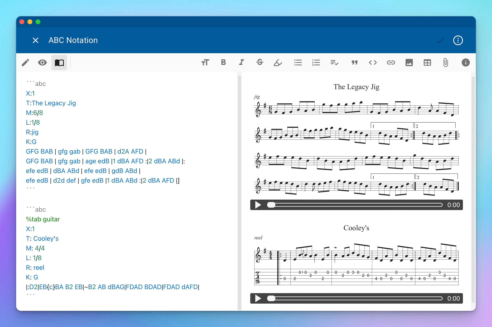
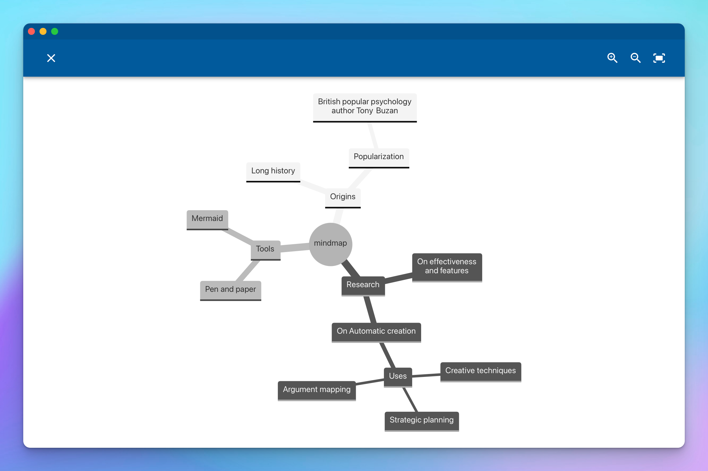
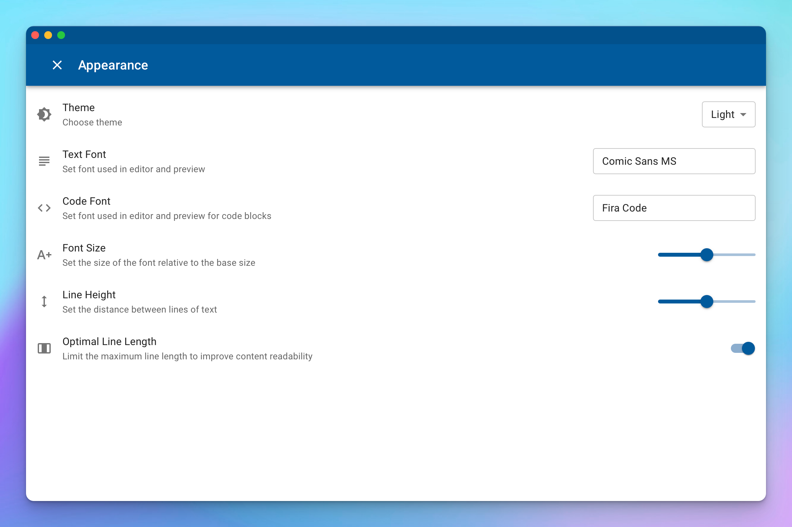

This is first significant release after major overhaul of NotesHub 3.0. It comes with set of good features and improvements in response to customers feedbacks.

## Auto-generated table of contents (TOC)
Navigation in large notes can be difficult. Luckily now you have the right tool to make it easier. It's always accessible (when you have more than one heading in your note) in preview mode under _Table of Contents_ menu item.

")

## Support of ABC musical notation
It's fascinating how many things you can describe with just plain text. In addition to Mermaid diagrams and math expressions which were added in previous release we are pleased to announce that now we have something to offer to musicians as well. [ABC musical notation](https://en.wikipedia.org/wiki/ABC_notation) is supported now and can be added via fenced code blocks when marked as `abc` language.

For stringed instruments, you can also display tabs by adding the following line `%tab YOUR_INSTRUMENT` where `YOUR_INSTRUMENT` can be one of the following values: _guitar, mandolin, fiddle, violin_.

MIDI playback is also supported with ability to play/pause and seek.

## Pan & zoom support for Mermaid diagrams
Mermaid is a great library for defining diagrams in simple text format. The problem however can arise while previewing large complex diagrams and especially when screen real estate is limited (smartphones, etc). Since the library does not have any build-in solution for this we came up with our own. Simply by clicking on diagram's preview will open full-window sized dialog where you can pan and zoom the diagram and it works even with touch screen devices using your fingers.

## New settings for editor and preview

Under _Settings_ you will find a new _Appearance_ section where there are customization options like: _Theme_, _Text Font_, _Code Font_, _Font Size_, _Line Height_ and _Optimal Line Length_.

## Optimal line length
Many studies show the importance of limiting maximum line length in the text for content readability. If the lines are too short then the text becomes disjointed; if they are too long, the content loses rhythm as the reader searches for the start of each line. That's why you can see this limit imposed in many blogs, news sites, apps, etc. You can read more about the line length [here](https://en.wikipedia.org/wiki/Line_length#Electronic_text).
With this release we are introducing new setting **Optimal Line Length** which is turned on by default and will limit lines to 75 characters. You can turn it off in _Settings -> Appearance -> Optimal Line Length_.

## Multi-window support
There are situations when you want to have multiple notes side by side in order to compare content or copy/paste some parts, etc. Before Today it was particularly challanging operations in native versions of NotesHub (macOS, Windows). There are several posible solutions to this problem. One of them is using tabs, but in order to preserve the minimalizm and simplicity of the app this solutions was dismissed. Another most obvious solution is to use multiple windows. When using Web app this works out of the box since all browsers can do this, but it was not the option for native apps. Now you have two options to open a new window: select _Create a new window_ from Dock/Taskbar for the app, or click _Open Link in New Window_ for any internal link in the app.

## Other notable features
- Settings such as theme, language, and others are now synced between tabs/windows on change.

## Important fixes
- Adds support of special characters in username and password when using Git notebook provider.
- The web version of the application now correctly works offline.
- Back/forward navigation with gestures has been added back with better consistency (iOS).
- Fixes compatibility with iOS/iPadOS 15.* (iOS).
