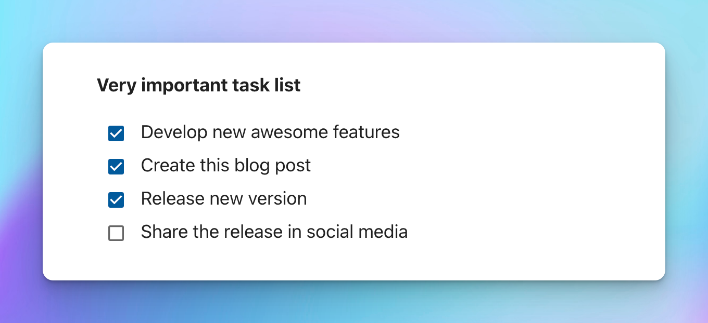
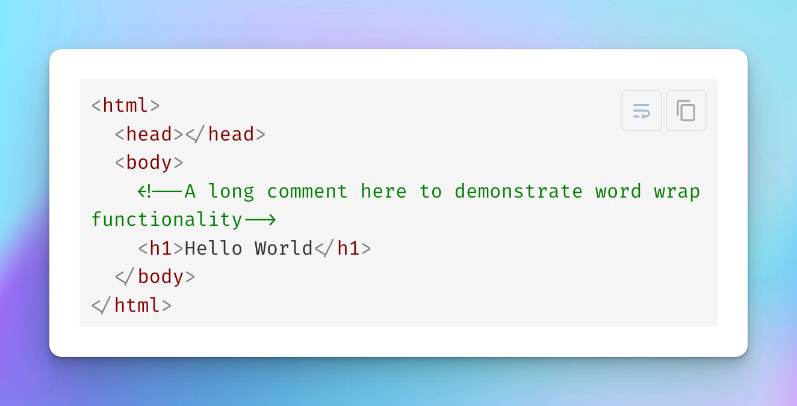

## Interactive checkboxes in the preview

You asked? We heard you! Now, you are not required to go into edit mode for your notes just to check/uncheck your tasks. Checkboxes are interactive even in the preview mode.

## New hotkeys for a better editing experience

To provide a better experience when working with a keyboard we added a few useful hotkeys:
- `⌘+E` (Mac) or `Ctrl+E` (Windows) - start editing your note.
- `⌘+S` (Mac) or `Ctrl+S` (Windows) - save your note edits.
- `Escape` - exit edit mode.

## Action buttons for code blocks

Now, when you hover over code blocks, the new _Copy To Clipboard_ button will appear in the corner.
In addition, if the content inside of the code block is overflowing you will see another button _Word Wrap_.
On mobile devices, click anywhere in the block to display those buttons.

## Relative links support

Previously, when using internal links in the app, you were limited to `/` for notebook root access and with the path relative to the current directory. Now, you can use any relative operands like `./` for the current directory and `../` for the parent directory to reference your resources.

Here are some examples of valid internal links:
- `[My document](file.pdf)`
- `[My document](./file.pdf)`
- `[My document](some-folder/file.pdf)`
- `[My document](/some-folder/file.pdf)`
- `[My document](../../some-folder/file.pdf)`

## Navigation between documents

Before this release, regardless of the type of your referenced resource, clicking on an internal link would download the resource. Now, if you have an internal link to a Markdown note or a Kanban board, clicking on it will perform navigation to the resource.

## Other notable features
- Adds support for underline HTML tag `<u>` in Markdown.
- Adds syntax highlighting for `Ini` and `VB.NET` languages in code blocks for preview.

## Important fixes
- Fixes the reverse order for the next and previous buttons when performing in-note search.
- Fixes the issue when in some scenarios due date was showing the wrong value after the board reopening (Kanban Boards).
