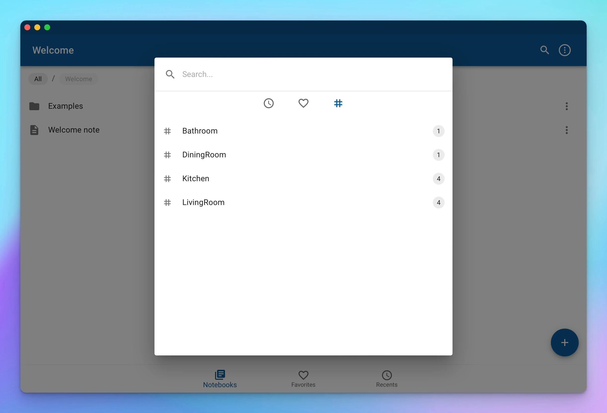
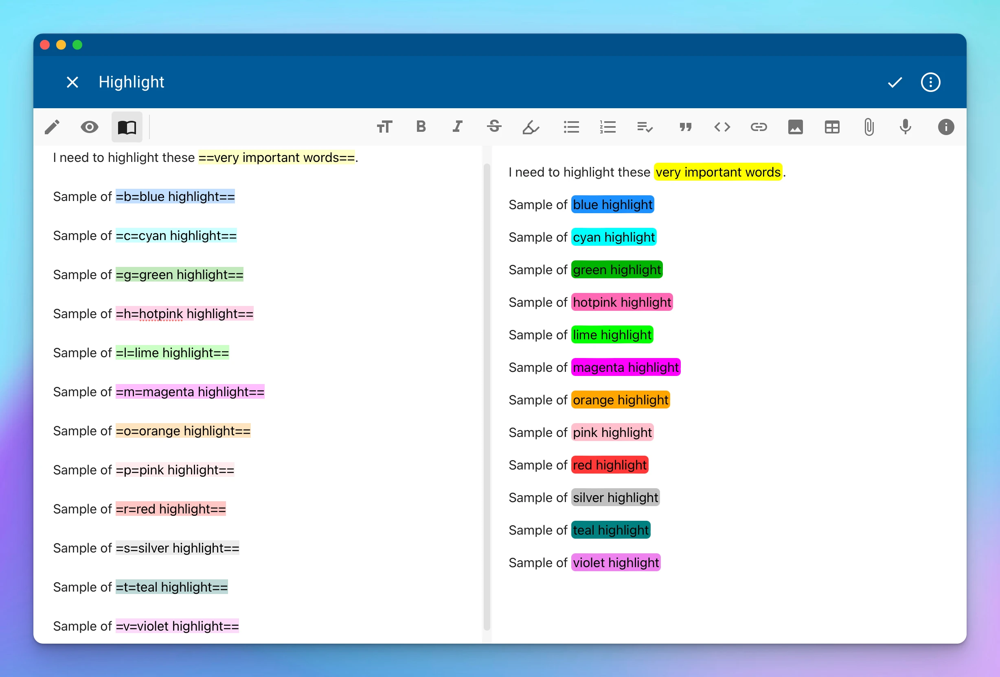
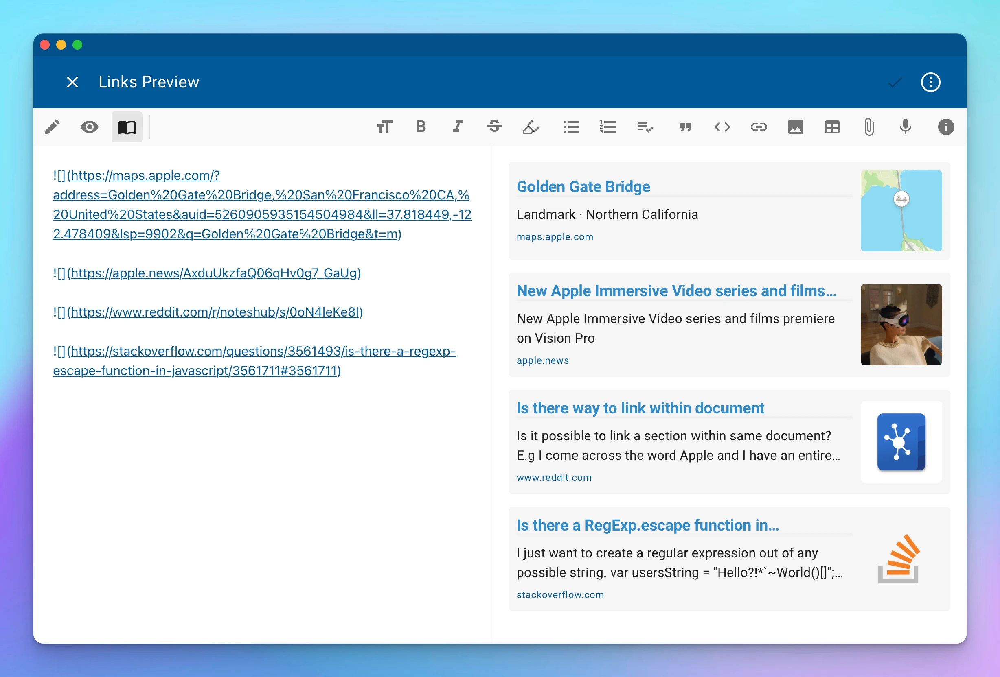

Finally, the most requested feature is here. **Search** was one of the few fundamental pieces missing in NotesHub. Let's celebrate the arrival, hurrah 🎉

## Search

To start searching for content across all of your files, tap the corresponding icon in the upper right corner. The functionality is available from the notebooks and folder views. When performing the search from inside the folder, you narrow the scope of the operation to that specific folder and all of its subfolders. We also made sure that the search would understand the semantic differences between different types of documents. For instance, for whiteboards, we will look only into text nodes, ignoring all other SVG elements.

The search dialog has a query input field and three sections for quick searches, which are visible at any time when the query is empty.
As quick search options, you have:
- **Recent searches** — queries will appear here once you have navigated to documents from the corresponding queries.
- **Favorite searches** — here you can find your favorite search queryes, which for convenience, have friendly names; you can add a new favorite search query after performing the search and navigating to `...` then _Add to Favorites_.
- **Tags** — in the final section, you can find all available hashtags for the giving scope; nested tags will be represented in the hierarchical structure; once selected, the search will be performed for a specific hashtag.

")

")

### Query syntax
Search queries consist of search terms, comprising text you want to search for, and filters, which narrow down the search.
A bare term with no filter will match either the content of a file or the file's name.
To make it more clear, a simple request like `Hello World` is equivalent to `(name:Hello OR content:Hello) AND (name:World OR content:World)`

#### Boolean operations
The search engine supports the following three operators:
- `AND` — returns a combined result only when both left and right subqueries return something; this is a default operator inserted implicitly when there is no other operator between terms.
- `OR` — returns a combined result when left or right subqueries return something.
- `NOT` (`-`) — negation unary operator returns the opposite result of the right subquery.

Since different operators have different priorities, like `AND` has precedence over `OR` operator, you can manage priorities by enclosing your subqueries into parenthesis `()`.

#### Exact phrase match
To search for the exact phrase, including whitespaces, you can surround the string in quotes. For example:
```js
"Hello World"
```
This will ensure those terms are found together and in the right order.

To include quotes (`"`) in your query, escape them with backslash `\`. For example `"\"cats\""`.

#### Regular expressions
For more advanced scenarios we offer regular expressions support, by surrounding the expression in forward slashes. For example:
```js
/^\d{4}-\d{2}-\d{2}T\d{2}:\d{2}:\d{2}\.\d{3}Z$/
```
The pattern above will match ISO 8601 date and time string, such as `2020-12-03T15:52:34.000Z`.

To include forward slashes (`/`) in your regular expression, escape them with backslash. For example `/\d{2}\/\d{2}\/\d{4}/`.

#### Query filters
Filters help to narrow down the search by looking only at specific fields or sections of the file.
To specify a filter, prepend the term with the filter name followed by colon.
For instance `type:kanban task:"My first task"` will search for Kanban boards containing "My first task" text inside of a task.

Below you can find the full list of all supported query filters:
- `name` — matches the specified text inside of a file's name (without extension).
- `type` — matches the type of the file, accepted values are _note_, _kanban_, _whiteboard_.
- `path` — matches the specified text inside of the folder path of the file.
- `notebook` — matches the specified text inside of the notebook name where the file is located.
- `content` — matches the specified text inside of the content of the file.
- `heading`, `heading1`...`heading6` (`h`, `h1`...`h6`) — matches the specified text inside of the heading element.
- `tag` — matches the specified text inside of a hashtag.
- `listitem` (`li`) — matches the specified text inside of list item.
- `task` — matches the specified text inside of the task in any state.
- `todo` — matches the specified text inside of the unfinished task.
- `done` — matches the specified text inside of the completed task.
- `attachment` (`att`) — matches the attachment of the specified type inside the file; accepted values are _image_, _audio_, _video_, and _location_.

### Scoring
The search results are sorted by relevance, driven by a scoring system. The score is calculated based on the density of matches in a particular field (name, type, content, etc.) multiplied by the field boost (name has a higher boost than content, for instance).

## Tags

With the introduction of search, we also added a tagging system that enables cross-referencing content by topic or theme.
The tag starts with `#` symbol followed by alphanumeric characters (the first character must be alpha). To use nested tags, separate them with a forward slash, for example `#recipe/vegan`.
The search dialog, as previously discussed, contains a dedicated section where you can see all available tags for a quick search.



## Find in note

Previously, if you wanted to find some text inside a note file, you would need to go to edit mode first.
With this release, this functionality is available even in preview mode. Press `Cmd+F` (`Ctrl+F` on Windows) or go to _... -> Find_ to display a Find panel with familiar functionality.


## Filters (Kanban boards)
When you have a lot of cards on your Kanban board, it could be problematic to find the right one. You may want to see all overdue cards, all completed ones, or those with a particular tag. We've got you covered: press `Cmd+F` (`Ctrl+F` on Windows) or go to _... -> Filter_ to open a Filter panel.

")

From there, you can use the input search field to filter by text or use the menus on the right side for a quick filtration by tags, due dates, tasks, etc.

The input search field is powered by the same search engine as the primary search functionality. It means you can use all the boolean operators, regular expressions, etc. The difference is only in supported query filters, which, in this case, are tailored for Kanban cards.

### Query filters
- `title` — matches the specified text inside of a card's title.
- `details` — matches the specified text inside of a card's details content.
- `tag` — matches the specified text inside of a card's tags.
- `due` — matches the card's due date state; accepted values are _completed_, _overdue_, _day_, _week_, _month_.
- `tasks` — matches the card's subtasks state; accepted values are _todo_, _inprogress_, _done_.
- `has` — matches the presence of the specified card's field; accepted values are _details_, _tags_, _tasks_, _due_, _estimates_.
- `is` — matches the specfied card's state; accepted value is _completed_.

## Multicolored highlight tool

The highlight tool got supercharged with the support of different highlighting colors.
To specify a non-default color, insert a corresponding one-character code between two `=` characters of the front marker. For example: `Sample of =l=lime highlight==`.



Below, you will find the list of all supported color codes:

Code | Color
--|--
b | Blue
c | Cyan
g | Green
h | Hotpink
l | Lime
m | Magenta
o | Orange
p | Pink
r | Red
s | Silver
t | Teal
v | Violet
y | Yellow

## Rich link previews

With this release, we once again extend what Markdown image elements can do. By specifying a regular web page URL as an image source, the app will auto-generate a rich link preview with a title, description, and image to help you visualize what is hiding behind the URL.



## Other notable features

- Links in whiteboards can be used for internal navigation to different documents.
- Adds syntax highlighting for `git` in code blocks for preview.
- Adds `bat` alias for `batch` language used for syntax highlighting.
- Lists all available languages for syntax highlighting in preview in Markdown Syntax guide dialog.
- Adds minutes as a supported type for Kanban card estimates.

## Important fixes
- Now, the `Copy to Clipboard` code block button appears even for unrecognized languages.
- Fixes pasting links from the share sheet.
- Fixes the issue with the stale state of a Kanban card subtasks completion progress when clearing card content.
- Fixes the issue with some key bindings not working on Windows with non-English keyboard layout.
- Fixes rendering of collapsible nested callouts.
- Fixes highlight tool not correctly working with complex content.
- Fixes the situation when a note can disappear after an attempt to save it with an empty name.
- Fixes the situation on the iPhone when the app can become stuck and not load any content.
