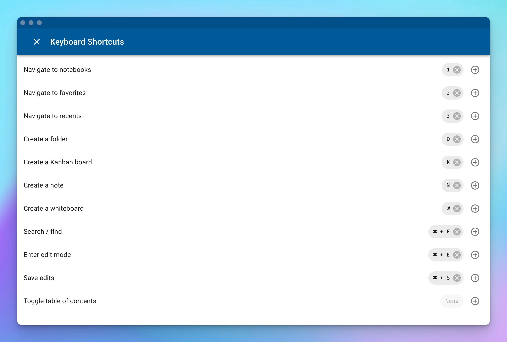
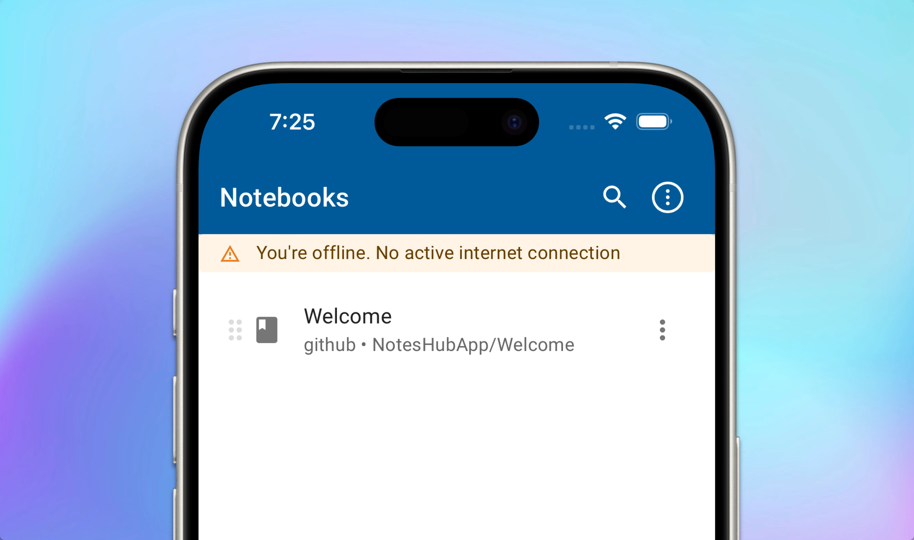
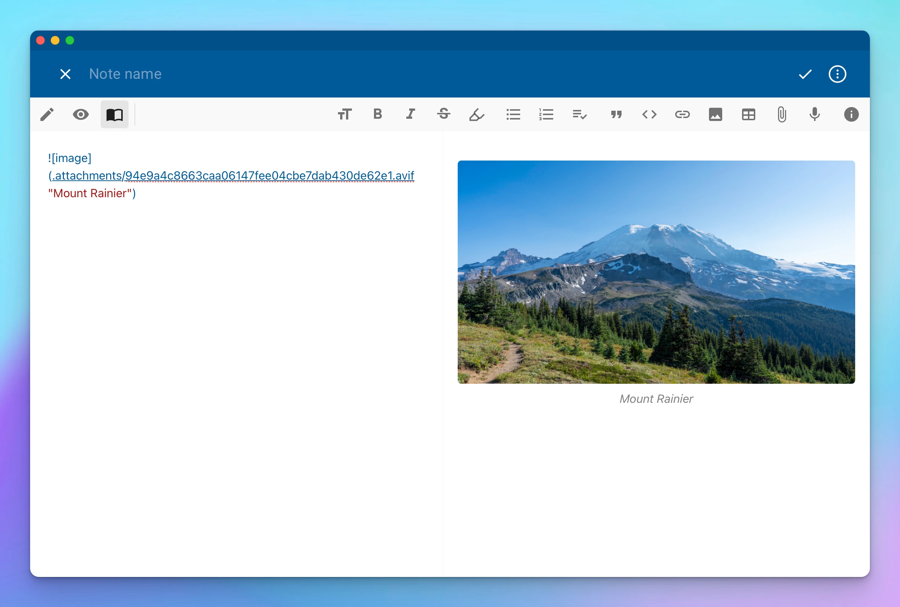

## Apple Vision Pro
NotesHub was available for Apple Vision Pro via an iPad-compatible version from day one. While it worked, the experience was far from perfect. With this release, we are introducing a dedicated Apple Vision Pro app. Even so, there is still room for improvement, this is a significant first step in this direction.

With the new app, you can open files in separate windows to take advantage of the enormous Apple Vision Pro real estate. Windows are resizable now, which can be really handy for Kanban boards or whiteboards. Images in notes could be previewed in full size with the ability to zoom. Lastly, eye tracking works better on menus and other items.

## Hotkey manager
We are introducing a few new hotkeys and a hotkey manager. With this addition, you can tailor the hotkeys to your needs and even have multiple of them per action.

## Network status banner
In situations with no network connectivity, to better understand whether data sync is going to happen, we are introducing a network status banner that will show up when the application goes into offline mode.

## Media element captions
Once again, we are extending what Markdown image elements can do. This time, we are leveraging the standard title image syntax to display them as captions. To specify the title/caption, add an optional text enclosed in quotes after the image URL/path separated by space ``. This works for audio and video elements, too.

## Other notable features
- View a Markdown image in fullscreen by clicking on it.
- _Open Link in New Window_ action for iPad and Apple Vision Pro.
- Adds File System notebook provider for Android.
- Adds German localization (special thanks to Sven M. for volunteering to work on this).
- Auto-pairing of backticks in Markdown.
- New key-bindings:
  - `1` - navigate to notebooks
  - `2` - navigate to favorites
  - `3` - navigate to recents
  - `D` - create folder
  - `N` - create new note
  - `K` - create new Kanban board
  - `W` - create new whiteboard
- Adds syntax highlighting for `pascal` language in code blocks for preview.

## Important fixes
- Improves network status detection for iOS and Android.
- Fixes unquoting a block with empty lines.
- Now, code blocks will always have wrapped lines on the print.
- Accessibility improvements for using the app with voice-over (narrator) and a keyboard.
